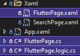

# C# Markup 2
Enjoy a Flutter-like UI development experience with .NET Hot Reload and the best .NET UI frameworks

- Build .NET applications **fully in C#**
- Target browsers and native desktop / mobile
- Use existing UI frameworks. Mature or bleeding edge is *your* choice:<br />
  WPF, WinUI 3, Uno Platform. Coming: AvaloniaUI, Maui, possibly Blazor.
- Use the built-in MVVM support - or any other update model that supports your UI framework (e.g. [ReactiveUI](https://www.reactiveui.net/))
- Use for part or all of your application UI
- Designed to go big and fast<br />
  Practically allocation-free, no reflection, efficient C#

No XAML / HTML / JavaScript / CSS required


> NuGet<br />
>[](https://www.nuget.org/packages/CSharpMarkup.WinUI)
>[](https://www.nuget.org/packages/CSharpMarkup.WPF)

> Chat (if needed, [join DotNetEvolution](https://aka.ms/dotnet-discord) first)<br />
> [](https://discord.com/channels/732297728826277939/931198774234189844)<br />
> **The best place to ask questions or help!**

# Getting Started
- [Getting started with C# Markup 2 for WPF](#getting-started-for-wpf)
- [Getting started with C# Markup 2 for WinUI 3 and Uno Platform](#getting-started-for-winui-3-and-uno-platform)

*Looking for C# Markup 1? Find it [here](https://github.com/VincentH-Net/CSharpForMarkup/tree/csharpformarkup1-archive)*

# News
*February 15, 2022*
> ## New 0.6 release: adds WPF and many improvements!
See [here](https://github.com/VincentH-Net/CSharpForMarkup/releases/tag/csharpmarkup2-winui-wpf-0-6-14) for the full list of improvements

*November 30, 2021*
>## C# Markup 2 announced at UNOCONF 2021!
> This first preview targets WinUI 3 and Uno Platform - including browser webassembly - with C# 10 and .NET 6. It supports .NET Hot Reload for a fast inner dev loop.
>
> See the [C# Markup 2 announcement at UNOCONF 2021](https://youtu.be/UJ7EzQeEQAg?t=2566):
> [](https://youtu.be/UJ7EzQeEQAg?t=2566)

## Getting started for WPF
1. Clone this repo
2. Open [CSharpMarkup.Wpf.Examples.sln](src/CSharpMarkup.Wpf.Examples/) and explore the source for the example pages. Note how page markup and page logic are separated in partial class files, and integrated with `Build()`, `Assign()` and `Invoke()`.
3. .NET Hot Reload is supported; edit and save the page markup in VS 2022 while debugging to see instant updates
4. To learn how to use C# Markup 2, read the [features description](#features) below and experiment in the example app
5. To build your own app, reference [](https://www.nuget.org/packages/CSharpMarkup.WPF) from a .NET 6 WPF project and create the C# Markup UI windows, pages etc in that project. Note that for existing apps you can reference (WPF / class library) projects that target older .NET versions from the .NET 6 project, so you can add C# Markup UI to your app without having to migrate existing WPF UI and/or logic to .NET 6 and C# 10.

## Getting started for WinUI 3 and Uno Platform
First check if your development environment is ready for Uno Platform and WinUI 3:
a) If you only want to target Windows desktop with WinUI 3:
  - [Get started with the Windows App SDK](https://docs.microsoft.com/en-us/windows/apps/windows-app-sdk/#get-started-with-the-windows-app-sdk)
b) If you also want to target other OS-es with WinUI 3, using Uno Platform:
  - [Using Visual Studio 2022 on Windows](https://platform.uno/docs/articles/get-started-vs-2022.html)
  - [Using other IDE's and OS-es](https://platform.uno/docs/articles/get-started.html)

Now you are ready to work with the WinUI 3 and Uno Platform example app:

1. Clone this repo
2. Open [CSharpMarkup.WinUI.Examples.sln](src/CSharpMarkup.WinUI.Examples/)
3. Explore the example pages in the `Examples.Shared` project
4. Debug the `Examples.Wasm` or the `Examples.Windows.Desktop` project
5. To use hot reload in VS2022 Preview:
   1. Debug the `Examples.Windows.Desktop` project
   2. Edit the markup
   3. Click  in Visual Studio
   4. After the Visual Studio status bar says , click  in the app
6. To learn how to use C# Markup 2, read the [features description](#features) below and experiment in the example app
7. To build your own app, reference [](https://www.nuget.org/packages/CSharpMarkup.WinUI) from a .NET 6 WinUI 3 project and create the C# Markup UI windows, pages etc in that project. Note that for existing apps you can reference (WinUI 3 / class library) projects that target older .NET versions from the .NET 6 project, so you can add C# Markup UI to your app without having to migrate existing WinUI 3 UI and/or logic to .NET 6 and C# 10.

# Features
C# Markup 2 contains a full declarative, fluent API for existing UI frameworks. It surfaces virtually every layout, view and property, including attached properties, and includes **full inline documentation** that links each markup helper / parameter to the inline documentation for the underlying UI object / property.

The rich frameworks that C# Markup 2 surfaces can contain as much as **500+ UI object types**. E.g. layouts, views and styles, but also brushes, rich text elements, drawing primitives, transformations, animations, visual states and more. In addition C# Markup offers powerful and concise **convenience API's** for layout, bindings, convertors, templates and more.

- When targeting **Windows Desktop**, the WinUI API from Windows App SDK is surfaced (without any dependency on Uno Platform).
- When targeting **Uno Platform**, the Uno.WinUI API is surfaced (atm only webassembly is tested, but any Uno target platform that can support .NET 6 and C# 10 should work)
- When targeting **WPF**, the WPF API is surfaced.

## Basic markup anatomy
Layouts, views, properties and property values look like this:<br />
<br />
All properties can be set with extension methods - properties defined on the view type or it's base types, as well as attached properties.

**Properties that are defined directly on the view type** can alternatively be set with named parameters:<br />
<br />
This is mainly useful for properties that take primitive types.

**Properties that take enum values** have extension methods so the enum name does not have to be repeated<br />(as in `TextAlignment: TextAlignment.Center`):<br />


**Attached property** names are prefixed with the defining type plus underscore:<br />


In addition to this, there are convenience overloads for some view types with just the most commonly used parameters:<br />


## Styles
Styles can be assigned like this:<br />


And defined like this:<br />


## Templates
Templates are passed in as a `Func<UIElement>`:<br />


## Enums for Grid rows and columns
You can use enums instead of numbers for Grid rows and colums. This improves readability and saves you from manually renumbering rows and columns when adding/removing/reordering them<br />


## Shorthand helpers
Shorthand helpers are included as an alternative to common combinations of markup helpers:


 

## Insert layout children: conditional and Spread

All layouts ignore `null` values in their `children`; this makes it possible to have conditional views depending on the value of an expression at page (re) build time.

The `Spread` helper allows to insert a variable number of children at a specific position in the `children` list (similar to what Flutter offers).


## Binding power
Thanks to C# 10, you don't have to use strings or `nameof()` to specify binding paths *with good performance* :<br />


**Note** that the `pathExpression` parameter supports several **convenience binding syntaxes**; see it's intellisense description in above image.

`Bind` supports almost all functionality that the UI framework offers for binding. In addition, there are many `Bind` overloads that offer:
- Omit the property name to bind to the **default property** of a view type:<br />
- Bind with **inline conversion**:<br />
- Bind a **command and it's parameter** in one go:<br />

## Page anatomy - separate markup and UI logic
A typical markup page starts like this:

`FlutterPage.cs`:
```csharp
using CSharpMarkup.<UI framework name>;
using static CSharpMarkup.<UI framework name>.Helpers;

namespace Examples;

partial class FlutterPage
{
    public void Build() => Content = 
```

Note the use of `partial class`; this lets you separate the UI markup from **UI logic**:

`FlutterPage.logic.cs`:
```csharp
using <UI framework namespace>.Controls;

namespace Examples;

public sealed partial class FlutterPage : Page, IBuild
{
    readonly FlutterViewModel vm;

    public FlutterPage()
    {
        InitializeComponent(); // Only needed for WinUI
        DataContext = vm = <obtain viewmodel instance>;
        Build();
```

**IMPORTANT:**<br />
- In **`<page>.cs`**:<br />
Include `CSharpMarkup.*` namespace usings but **no UI objectmodel usings**.<br />
You *can* also use the UI objectmodel safely in `<page>.cs`; a good practice then is to
define a `global using TypeName_UI = <UI objectmodel namespace>.TypeName` alias in `GlobalUsings.cs`

- In **`<page>.logic.cs`**:<br />
**DO NOT** include `CSharpMarkup.*` namespace usings and **DO NOT** use `CSharpMarkup` objects.<br />
Markup object instances are not safe to use outside of a markup expression (due to performance features - each markup object has a single static instance to prevent allocating an extra object for each view).
That is why `Assign` and `Invoke` pass the UI object contained in the markup object to the logic, not the markup object itself.

> **Note** at the moment WinUI still requires that you have a XAML file for a page. It only needs to contain an empty `Page` element though, and you can move those files out of sight in a folder, e.g. `Xaml`:<br />
> 

## Integrate UI markup with UI logic
With `Assign` and `Invoke` you can integrate UI markup with UI logic:

`SearchPage.cs`:<br />


`SearchPage.logic.cs`:<br />


`SearchPage.cs`:<br />


`SearchPage.logic.cs`:<br />


> **Note**:<br />
> In `SearchPage.cs`, `StackPanel` and `TextBox` are **markup** object types, while<br />
> in `SearchPage.logic.cs` they are the corresponding **UI framework** object types

# Development workflow tips

## Improve markup colorization in Visual Studio
There is no C# Markup IDE extension (yet...) to properly colorize markup, however C# Markup readability can be improved with this workaround in Visual Studio options:

Under `Fonts and Colors`, copy the color of `User Types - Classes` to `User Members - Methods` (with the `Custom...` button). Now the markup color for views and properties will no longer be the same.


## Fast inner dev loop with .NET Hot Reload
Get the fastest inner dev loop for C# Markup 2 by using .NET Hot Reload in Visual Studio 2022 Preview, targeting `Windows.Desktop` (packaged). Even when you are not targeting Windows, this is good for getting most of your UI build work done as quickly as possible. Switch to other target(s) to finetune and test.

Since at this moment detecting hot reload in WinUI 3 is broken in .NET SDK, a workaround is to conditionally add a hot reload button on your pages for a debug Windows build. The example contains a `.WithHotReloadButton()` extension method to do this.
In the WPF example app a small hot reload handler is included to automatically rebuild the UI on hot reload, so there is no button workaround needed there.
