# C# Markup 2
Enjoy a Flutter-like UI development experience with .NET Hot Reload and the best .NET UI frameworks

- Build .NET applications **fully in C#**
- Target browsers and native desktop / mobile

No XAML / HTML / JavaScript / CSS required

## [NuGet: CSharpMarkup.WinUI](https://www.nuget.org/packages/CSharpMarkup.WinUI)

*Looking for C# Markup 1? Find it [here](https://github.com/VincentH-Net/CSharpForMarkup/tree/csharpformarkup1-archive)*

# News

*November 30, 2021*
>## C# Markup 2 announced at UNOCONF 2021!
> This first preview targets WinUI 3 and Uno Platform - including browser webassembly - with C# 10 and .NET 6. It supports .NET Hot Reload for a fast inner dev loop.
>
> See the [C# Markup 2 announcement at UNOCONF 2021](https://unoconf.com/)

# Features
C# Markup 2 contains a full declarative, fluent API for WinUI 3. It surfaces virtually every `DependencyObject` and `DependencyProperty` in WinUI 3, including attached properties, and includes **full inline documentation** that links each markup helper to the inline documentation for the underlying WinUI object / property.

The rich WinUI 3 framework that C# Markup 2 surfaces contains **500+ bindable object types**. Layouts, views and styles, but also brushes, rich text elements, drawing primitives, transformations, animations, visual states and more. In addition C# Markup offers powerful and concise **convenience API's** for layout, bindings, convertors, templates and more.

- When targeting **Windows Desktop**, the WinUI API from Windows App SDK is surfaced (without any dependency on Uno Platform).
- When targeting **Uno Platform**, the Uno.WinUI API is surfaced (atm only webassembly is tested, but any Uno target platform that can support .NET 6 and C# 10 should work)

See C# Markup features in action in the `CSharpMarkup.WinUI.Examples` solution in this repo.

> **NOTE** - this is an early preview, intended mainly to gauge interest and to get feedback on the shape and features of the markup API. 
> NJoy playing around with this and chime in with issues if you like / want things or if you have questions.
> 
> Twitter feedback is also welcome - use [#CSharpForMarkup](https://twitter.com/search?q=%23CSharpForMarkup&f=live) and [@vincenth_net](https://twitter.com/vincenth_net), thanks!
> 
> Only Windows Desktop and webassembly targets have been tested at this time, and there has been no webassembly performance optimization so far.
> Expect frequent updates in the coming weeks!

## Basic markup anatomy
Layouts, views, properties and property values look like this:<br />
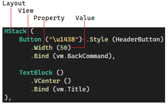<br />
All properties can be set with extension methods - properties defined on the view type or it's base types, as well as attached properties.

**Properties that are defined directly on the view type** can alternatively be set with named parameters:<br />
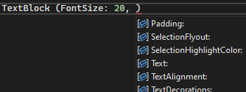<br />
This is mainly useful for properties that take primitive types.

**Properties that take enum values** have extension methods so the enum name does not have to be repeated<br />(as in `TextAlignment: TextAlignment.Center`):<br />
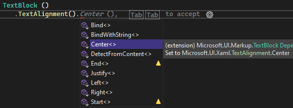

**Attached property** names are prefixed with the defining type plus underscore:<br />
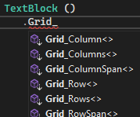

In addition to this, there are convenience overloads for some view types with just the most commonly used parameters:<br />
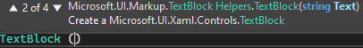

## Styles
Styles can be assigned like this:<br />
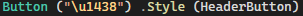

And defined like this:<br />
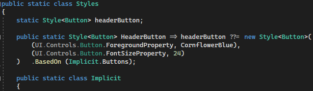

## Templates
Templates are passed in as a `Func<UIElement>`:<br />


## Enums for Grid rows and columns
You can use enums instead of numbers for Grid rows and colums. This improves readability and saves you from manually renumbering rows and columns when adding/removing/reordering them<br />
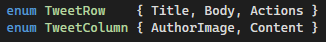

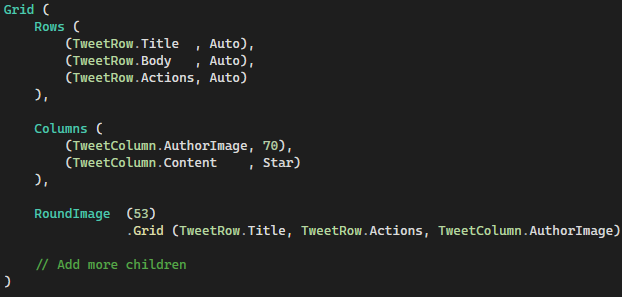

## Shorthand helpers
Shorthand helpers are included as an alternative to common combinations of markup helpers:

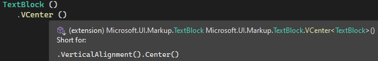

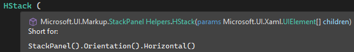 

## Insert layout children: conditional and Spread

All layouts ignore `null` values in their `children`; this makes it possible to have conditional views depending on the value of an expression value at page (re) build time.

The `Spread` helper allows to insert a variable number of children at a specific position in the `children` list (similar to what Flutter offers).

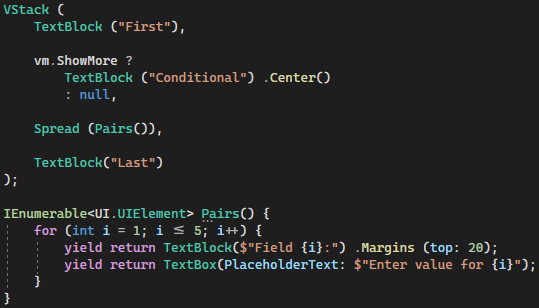

## Binding power
Thanks to C# 10, you don't have to use strings or `nameof()` to specify binding paths *with good performance* :<br />
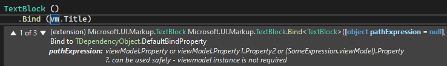

**Note** that the `pathExpression` parameter supports several **convenience binding syntaxes**; see it's intellisense description in above image.

`Bind` supports almost all functionality that WinUI 3 offers for binding. In addition, there are many `Bind` overloads that offer:
- Omit the property name to bind to the **default property** of a view type:<br />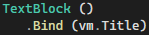
- Bind with **inline conversion**:<br />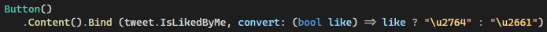
- Bind a **command and it's parameter** in one go:<br />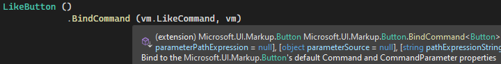

## Page anatomy - separate markup and UI logic
A typical markup page starts like this:

`FlutterPage.cs`:
```csharp
using Microsoft.UI.Markup;
using static Microsoft.UI.Markup.Helpers;

namespace WinUICsMarkupExamples;

public partial class FlutterPage
{
    public void Build() => Content = 
```

Note the use of `partial class`; this lets you separate the UI markup from **UI logic**:

`FlutterPage.logic.cs`:
```csharp
using Microsoft.UI.Xaml.Controls;

namespace WinUICsMarkupExamples;

public sealed partial class FlutterPage : Page, IBuild
{
    readonly FlutterViewModel vm;

    public FlutterPage()
    {
        InitializeComponent();
        DataContext = vm = App.Current.FlutterViewModel;
        Build();
```

## Integrate UI markup with UI logic
With `Assign` and `Invoke` you can integrate UI markup with UI logic:

`SearchPage.cs`:<br />
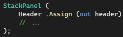

`SearchPage.logic.cs`:<br />


`SearchPage.cs`:<br />
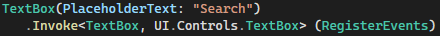

`SearchPage.logic.cs`:<br />
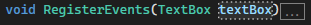

> **Note: in code behind do NOT use Microsoft.UI.Markup**, only the UI object model.
> 
> Due to a performance preservation mechanism in Markup objects, Markup object instances are not safe to use outside of a markup expression.
> 
> That is why Assign and Invoke pass the UI object to the logic, not the markup object.
 
# Development workflow tips

## Improve markup colorization in Visual Studio
There is no C# Markup IDE extension (yet...) to properly colorize markup, however C# Markup readability can be improved with this workaround in Visual Studio options:

Under `Fonts and Colors`, copy the color of `User Types - Classes` to `User Members - Methods` (with the `Custom...` button). Now the markup color for views and properties will no longer be the same.

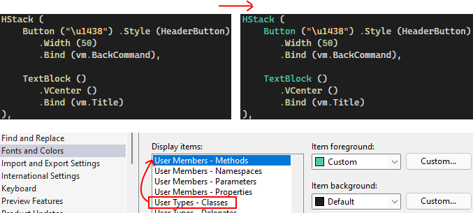

## Fast inner dev loop with .NET Hot Reload
Get the fastest inner dev loop for C# Markup 2 by using .NET Hot Reload in Visual Studio 2022 Preview, targeting `Windows.Desktop` (packaged). Even when you are not targeting Windows, this is good for getting most of your UI build work done as quickly as possible. Switch to other target(s) to finetune and test.

Since at this moment detecting hot reload in WinUI 3 is broken in .NET SDK, a workaround is to conditionally add a hot reload button on your pages for a debug Windows build. The example contains a `.WithHotReloadButton()` extension method to do this.
