# C# Markup 2
Enjoy a Flutter-like UI development experience with .NET Hot Reload and the main .NET UI frameworks

- Build **.NET applications fully in C#**
- Target browsers and native desktop / mobile
- Use existing UI frameworks. Mature or bleeding edge is *your* choice: WPF, WinUI 3 for Windows App SDK and Uno Platform. Coming: AvaloniaUI, Maui, possibly Blazor.
- Use the built-in MVVM support - or any other update model that supports your UI framework (e.g. [ReactiveUI](https://www.reactiveui.net/))
- Use for part or all of your application UI
- Designed to handle large UI fast: practically allocation-free, no reflection, efficient C#

No XAML / HTML / JavaScript / CSS required. No engine or layers to get in your way.

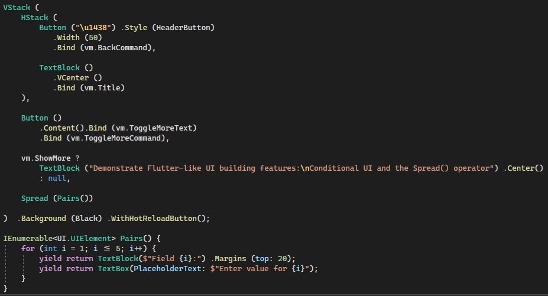

> NuGet<br />
>[](https://www.nuget.org/packages/CSharpMarkup.WinUI)
>[](https://www.nuget.org/packages/CSharpMarkup.WPF)

> Chat (if needed, [join DotNetEvolution](https://aka.ms/dotnet-discord) first)<br />
> [](https://discord.com/channels/732297728826277939/931198774234189844)<br />
> **The best place to ask questions or help!**

# Getting Started
- **WinUI 3**: [Getting started with C# Markup 2 for WinUI 3 and Windows App SDK / Uno Platform](#getting-started-for-winui-3-and-windows-app-sdk--uno-platform)
- **WPF**: [Getting started with C# Markup 2 for WPF](#getting-started-for-wpf)

*Looking for C# Markup 1? Find it [here](https://github.com/VincentH-Net/CSharpForMarkup/tree/csharpformarkup1-archive)*

# News
*June 27, 2023*
> ## 2.2 Release & start of .NET MAUI support
- [Release 2.2 is out](https://twitter.com/vincenth_net/status/1673330170441224192)! Enjoy this polished release for Windows App SDK, Uno Platform and WPF.
- As the poll results indicated, C# Markup 2 support for **.NET MAUI** is most wanted.<br />
  Implementation [has started](https://twitter.com/vincenth_net/status/1673383755023523857)!

*March 25, 2023*
> ## Poll results are in! And the winner is...
The March 2023 poll results on what to build next for C# Markup 2 are in!

A surprise addition was the ask for C# Markup 2 for Avalonia UI in the replies; it got a big response that catapulted it into a very close 2nd place.

Here are the results for the [poll](https://twitter.com/vincenth_net/status/1637065646688043012) including the likes for "Other" options [Blazor](https://twitter.com/vincenth_net/status/1637119462603145226) and [AvaloniaUI](https://twitter.com/alex8x8/status/1638278598267228163):

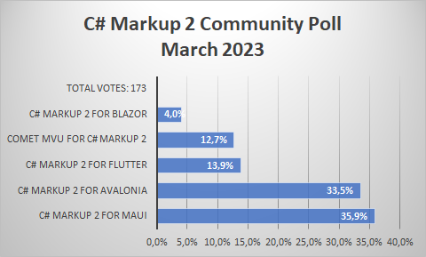

And the winner is: **C# Markup 2 for MAUI**!<br />
Watch and star this repo to catch the release; you can also watch [#CSharpForMarkup tweets](https://twitter.com/search?q=%23CSharpForMarkup&src=typed_query&f=live) for progress. Thanks for your response!

*Feb 28, 2023*
> ## Major Release - C# Markup 2 version 2.0 for WinUI 3!
C# Markup 2 version 2.0 for WinUI 3 is here! Completely updated to .NET 7, C# 11 and the latest Windows App SDK and Uno Platform.
With many improvements including 6 supported target platforms, C# hot reload support and [dotnet new project templates](https://github.com/Applicita/Modern.CSharp.Templates).

**Brought to you by Applicita**

Special thanks go to [Applicita](https://applicita.com/) for making this release possible; it's inspiring to see a company support OSS in this way (Applicita also open-sourced several [other useful libraries](https://github.com/Applicita))

More on what's new in this release [here](https://github.com/VincentH-Net/CSharpForMarkup/releases/tag/csharpmarkup2-winui-2-0-0).

*Feb 16, 2023*
> ## A new release of C# Markup 2 for WinUI 3 and Uno Platform is coming in Feb 2023
Updated to .NET 7, C# 11 and the latest Windows App SDK and Uno Platform. With many improvements - including C# hot reload support and a dotnet new project template.
Watch this space!

*April 14, 2022*
> ## New 0.8 release: adds `ControlTemplate` support and `Style` improvements!
See [here](https://github.com/VincentH-Net/CSharpForMarkup/releases/tag/csharpmarkup2-winui-wpf-0-8-2) and [here](https://github.com/VincentH-Net/CSharpForMarkup/releases/tag/csharpmarkup2-winui-wpf-0-8-1) for the full list of improvements

*February 15, 2022*
> ## New 0.6 release: adds WPF and many improvements!
See [here](https://github.com/VincentH-Net/CSharpForMarkup/releases/tag/csharpmarkup2-winui-wpf-0-6-14) for the full list of improvements

*November 30, 2021*
>## C# Markup 2 announced at UNOCONF 2021!
> This first preview targets WinUI 3 and Uno Platform - including browser webassembly - with C# 10 and .NET 6. It supports .NET Hot Reload for a fast inner dev loop.
>
> See the [C# Markup 2 announcement at UNOCONF 2021](https://youtu.be/UJ7EzQeEQAg?t=2566):
> [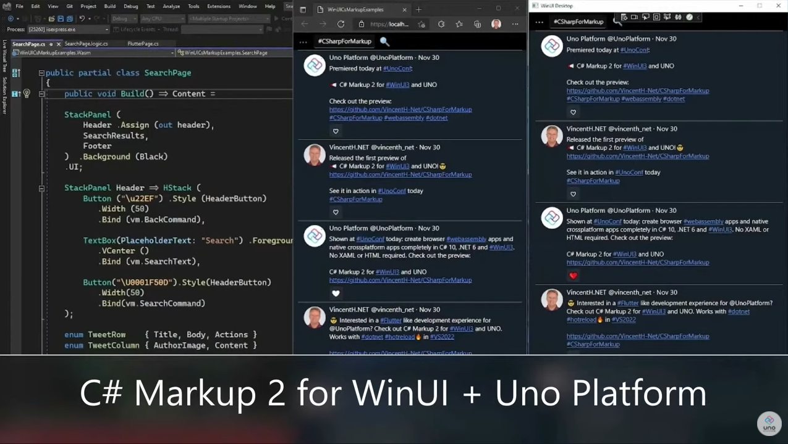](https://youtu.be/UJ7EzQeEQAg?t=2566)

## Getting started for WPF
1. Clone this repo
2. Open [CSharpMarkup.Wpf.Examples.sln](src/CSharpMarkup.Wpf.Examples/) and explore the source for the example pages. Note how page markup and page logic are separated in partial class files, and integrated with `Build()`, `Assign()` and `Invoke()`.
3. **.NET Hot Reload** is supported; edit and save the page markup in VS 2022 while debugging to see instant updates
4. To learn how to use C# Markup 2, read the [features description](#features) below and experiment in the example app
5. To build your own app, reference [](https://www.nuget.org/packages/CSharpMarkup.WPF) from a .NET 6 WPF project and create the C# Markup UI windows, pages etc in that project. Note that for existing apps you can reference (WPF / class library) projects that target older .NET versions from the .NET 6 project, so you can add C# Markup UI to your app without having to migrate existing logic and/or WPF UI to .NET 6 and C# 10.

## Getting started for WinUI 3 and Windows App SDK / Uno Platform
1) First check if your development environment is ready for WinUI 3:
    - To target Windows desktop with Windows App SDK:<br />[Get started with the Windows App SDK](https://learn.microsoft.com/en-us/windows/apps/windows-app-sdk/#get-started-with-the-windows-app-sdk)
    - To (also) target other OS-es with Uno Platform:<br />[with Visual Studio 2022 on Windows](https://platform.uno/docs/articles/get-started-vs-2022.html) or [with other IDE's and OS-es](https://platform.uno/docs/articles/get-started.html)

2) Install the [Modern.CSharp.Templates](https://www.nuget.org/packages/Modern.CSharp.Templates) for `dotnet new` to get [these templates for Windows App SDK, Uno Platform and more](https://github.com/Applicita/Modern.CSharp.Templates#readme)

3) Create a new solution with the `mcs-winui3-app` template, e.g.:
    ```
    dotnet new mcs-winui3-app --name Modern.Shop --allow-scripts Yes
    ```
    This will create a ready to run solution (in a new folder) with just a Windows target. The `--allow-scripts Yes` parameter will run a `dotnet new mcs-editorconfig` and then will open the solution (omit this parameter to get prompted whether you want those actions to run):

    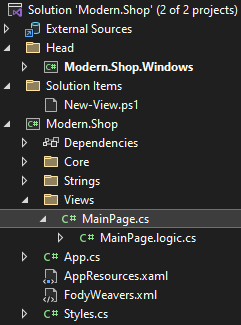

    You can use optional parameters to select more targets (Android, iOS, Mac Catalyst, WebAssembly, Skia/Tizen, Skia/WPF, and Skia/GTK for Linux). To see a list of all parameters for this template, run:
    ```
    dotnet new mcs-winui3-app -h
    ```

4) Set the Windows head as start project and run it

5) To add a new view (plus optional viewmodel), use the `New-View.ps1` script; e.g. open Visual Studio's `View|Terminal` window, type `n` + `Tab` to expand to the script name, and supply a name:
    ```
    .\New-View.ps1 Cart
    ```

    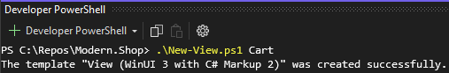

    This will create these files (intentionaly all in the same folder):

    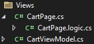

    The parameters are documented in the `New-View.ps1` script file

    Note that you can use the C# Markup in-app debugging overlay to navigate to the new view(s). You can quickly add many views and flesh them out in hot reload. No need to implement navigation first.

To learn how to use C# Markup 2, read the [features description](#features) below and inspect the [example app](src/CSharpMarkup.WinUI.Examples/)

## Fast inner dev loop with .NET Hot Reload
[Hot reload in Visual Studio for Windows](https://learn.microsoft.com/en-us/visualstudio/debugger/hot-reload?view=vs-2022) has been verified to work for editing existing C# Markup 2 views, viewmodels and styles in Windows, Android and Webassembly targets; other targets should work as well. If you have a Windows target, use that - currently it has the best update experience.

Steps:

1) Run an app head with debugging; you will see the main page with a debugging overlay for C# Hot Reload:

    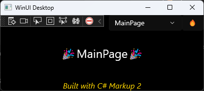

2) Navigate to the page you want to edit using the debugging overlay:

    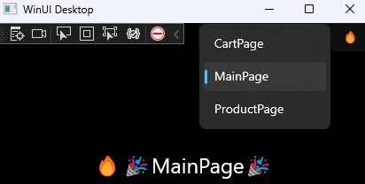

3) Edit the `<name>Page.cs`, `<name>ViewModel.cs` or the `Styles.cs` and save it; after the VS status bar says , click  in the app to rebuild your UI. Note that you can also check for hot reload messages in the output window:

    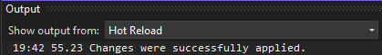

    For the Windows target the UI will update on save, no button click needed: the app listens to **`Ctrl+S`** (for the left Ctrl key). When you release those keys (S first, then Ctrl) it will rebuild the UI. So the flow is: Press and hold Ctrl+S until VS has applied the code changes, then release. After the first update this takes less than a second; after a few times it feels just as seamless as a proper automatic UI rebuild.
        
    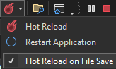

    You can toggle the UI rebuild off and on by pressing and releasing S twice instead of once (before releasing Ctrl). This is displayed in the debug output:

    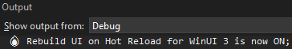

    Note that above are workarounds for various defects in MS Hot Reload; once these are fixed, the UI can update without a button or keyboard listener.

4) If you introduce other types (in addition to `Styles.cs`) that should update your UI when hot reloading, you can customize your `App.BuildUI()` method to rebuild their instances.

# Features
C# Markup 2 contains a full declarative, fluent API for existing UI frameworks. It surfaces virtually every layout, view and property, including attached properties, and includes **full inline documentation** that links each markup helper / parameter to the inline documentation for the underlying UI object / property.

The rich UI frameworks that C# Markup 2 surfaces can contain as much as **500+ UI object types**. E.g. layouts, views and styles, but also brushes, rich text elements, drawing primitives, transformations, animations, visual states and more. In addition C# Markup offers powerful and concise **convenience API's** for layout, bindings, convertors, templates and more.

- When targeting **Windows Desktop**, the WinUI API from the Windows App SDK is surfaced (without any dependency on Uno Platform).
- When targeting **Uno Platform**, the Uno.WinUI API is surfaced (atm only webassembly is tested, but any Uno target platform that can support .NET 6 and C# 10 should work)
- When targeting **WPF**, the WPF API is surfaced.

## Basic markup anatomy
Layouts, views, properties and property values look like this:<br />
<br />
All properties can be set with extension methods: properties defined on the view type or it's base types, as well as attached properties.

**Properties that are defined directly on the view type** can alternatively be set with named parameters:<br />
<br />
This is mainly useful for properties that take primitive types.

**Properties that take enum values** have extension methods so the enum name does not have to be repeated<br />(as in `TextAlignment: TextAlignment.Center`):<br />


**Attached property** names are prefixed with the defining type plus underscore:<br />


You can **set multiple attached property values** for the same defining type **in one call**:<br />
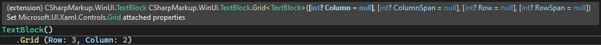

In addition to this, there are **convenience overloads** for some view types with just the most commonly used parameters:<br />


## Property value converters
Implicit converters are provided in the `to` subnamespace for common property value types:<br />
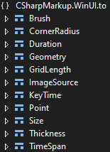

These are:
- All converters that accept `string` values, as specified by the UI framework with the [TypeConverter attribute](https://docs.microsoft.com/en-us/dotnet/api/system.componentmodel.typeconverterattribute)<br />
  Note that WinUI 3 Desktop does not use this attribute, but Uno Platform and WPF do.
- Additional manual converters that also accept other types than `string`, including tuples if more than one value is expected. E.g.:<br />
  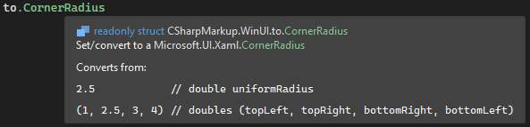<br />
  Allows you to specify:<br />
  `Button() .CornerRadius (2.5)` or<br />
  `Button() .CornerRadius ((2.5, 0, 2.5, 0))`

An example using `to.Point`:
```csharp
Button() .Background (RadialGradientBrush (Center: (50, 50), GradientOrigin: (100, 50)))
```

An example using `to.TimeSpan` and `to.Duration`:
```csharp
ColorAnimation (BeginTime: "0:0:5", Duration: 2.5)
```

In many cases the inline documentation on the `to.` type describes the supported values and formatting; especially for strings this can avoid guesswork.

## Styles
Styles can be assigned like this:<br />


And defined like this:<br />


In WPF you can bind a style setter value (WinUI 3 does not support this):<br />
 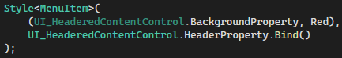

## Templates
A `DataTemplate` is passed in as a `Func<UIElement>`:<br />
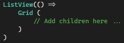

A `ControlTemplate` can be created like this:<br />
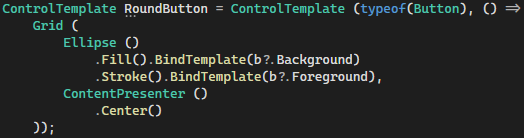
- The `.BindTemplate()` method lets you bind template properties to the templated parent
- The `targetType` parameter is optional
- `b` here is a null-valued `static UI_Button` field. In this example it only serves to demonstrate one way to get intellisense when editing binding expressions for a `Button`; see [Binding power](#binding-power) for details.

Here is how you can use a `ControlTemplate` in an implicit or explicit `Style`:<br />
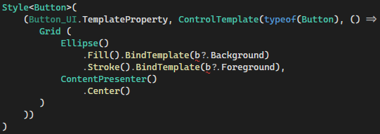

## Enums for Grid rows and columns
You can use enums instead of numbers for Grid rows and colums. This improves readability and saves you from manually renumbering rows and columns when adding/removing/reordering them<br />


## Shorthand helpers
Shorthand helpers are included as an alternative to common combinations of markup helpers:


 

## Insert layout children: conditional and Spread

All layouts ignore `null` values in their `children`; this makes it possible to have conditional views depending on the value of an expression at page (re) build time.

The `Spread` helper allows to insert a variable number of children at a specific position in the `children` list (similar to what Flutter offers).


## Binding power
Thanks to the C# 10 [CallerArgumentExpression attribute](https://docs.microsoft.com/en-us/dotnet/csharp/whats-new/csharp-10#callerargumentexpression-attribute-diagnostics), you don't have to use strings or `nameof()` to specify binding paths *with good performance*. Instead you can use C# expressions and enjoy all the goodness that they bring: full intellisense, compiler checked, renaming support :<br />


**Note** from the intellisense description in above image that the `pathExpression` parameter supports several **convenience binding syntaxes**, which allows to:
- Identify the viewmodel part of the expression with parenthesis:<br />
  path expression = `viewmodel.path` || `(viewmodel expression).path`, where `path` can contain `.` e.g.:
  - `.Bind (vm.SelectedTweet)` binds to "SelectedTweet"
  - `.Bind ((vm.SelectedTweet).Title)` binds to "Title"
  - `.Bind ((vm.SelectedTweet).Author.Name)` binds to "Author.Name"
- Use `?` with null-valued type instances to enjoy C# goodness without needing object instances e.g.:
  - `.Bind (vm?.SelectedTweet?.Title)` binds to "Title"<br />
  Note that using `?` can be necessary because the expression will be evaluated at runtime, even though we don't care about it's value; the [CallerArgumentExpression attribute](https://docs.microsoft.com/en-us/dotnet/csharp/whats-new/csharp-10#callerargumentexpression-attribute-diagnostics) supplies an expression string *in addition to* the expression value.
- You can still pass in string literals
  - `.Bind ("SelectedTweet")` binds to "SelectedTweet"

Any surrounding `"`, `@` or whitespace characters in `pathExpression` are ignored

`Bind` supports almost all functionality that the UI framework offers for binding. In addition, there are many `Bind` overloads that allows to:
- Omit the property name to bind to the **default property** of a view type:<br />
- Bind with **inline conversion**:<br />
- Bind a **command and it's parameter** in one go:<br />

## Page anatomy - separate markup and UI logic
A typical markup page starts like this:

`FlutterPage.cs`:
```csharp
using CSharpMarkup.<UI framework name>;
using static CSharpMarkup.<UI framework name>.Helpers;

namespace Examples;

partial class FlutterPage
{
    public void Build() => Content = 
```

Note the use of `partial class`; this lets you separate the UI markup from **UI logic**:

`FlutterPage.logic.cs`:
```csharp
using <UI framework namespace>.Controls;

namespace Examples;

public sealed partial class FlutterPage : Page, IBuild
{
    readonly FlutterViewModel vm;

    public FlutterPage()
    {
        InitializeComponent(); // Only needed for WinUI
        DataContext = vm = <obtain viewmodel instance>;
        Build();
```

### Namespace separation of markup and UI logic
**IMPORTANT:**<br />
- In **C# markup files** like **`<page>.cs`**:<br />
Include `CSharpMarkup.*` namespace usings but **no UI objectmodel usings** such as `using Microsoft.UI.Xaml;`<br /><br />
(by design the type names in the CSharpMarkup namespace are identical to the type names in the UI objectmodel,  so including both would not work)<br /><br />
Try to limit using the UI object model to UI logic files. If you must, you *can* use the UI objectmodel safely in C# markup files; a good practice then is to
define global namespace using aliases, e.g. `global using UI = Microsoft.UI.Xaml;`

- In **UI logic files** like **`<page>.logic.cs`**:<br />
Do not use `CSharpMarkup` objects<br /><br />
Markup object instances are not safe to use outside of a markup expression (due to performance features - each markup object type has a single static instance to prevent allocating an extra object for each view).
That is why `Assign` and `Invoke` (see [below](#Integrate-UI-markup-with-UI-logic)) pass the UI object contained in the markup object to the logic, instead of the markup object itself.

## Integrate UI markup with UI logic
With `Assign` and `Invoke` you can integrate UI markup with UI logic:

`SearchPage.cs`:<br />


`SearchPage.logic.cs`:<br />


`SearchPage.cs`:<br />


`SearchPage.logic.cs`:<br />


> **Note**:<br />
> In `SearchPage.cs`, `StackPanel` and `TextBox` are **markup** object types, while<br />
> in `SearchPage.logic.cs` they are the corresponding **UI framework** object types

# Development workflow tips

## Improve markup colorization in Visual Studio
There is no C# Markup IDE extension (yet...) to properly colorize markup, however C# Markup readability can be improved with this workaround in Visual Studio options:

Under `Fonts and Colors`, copy the color of `User Types - Classes` to `User Members - Methods` (with the `Custom...` button). Now the markup color for views and properties will no longer be the same.


