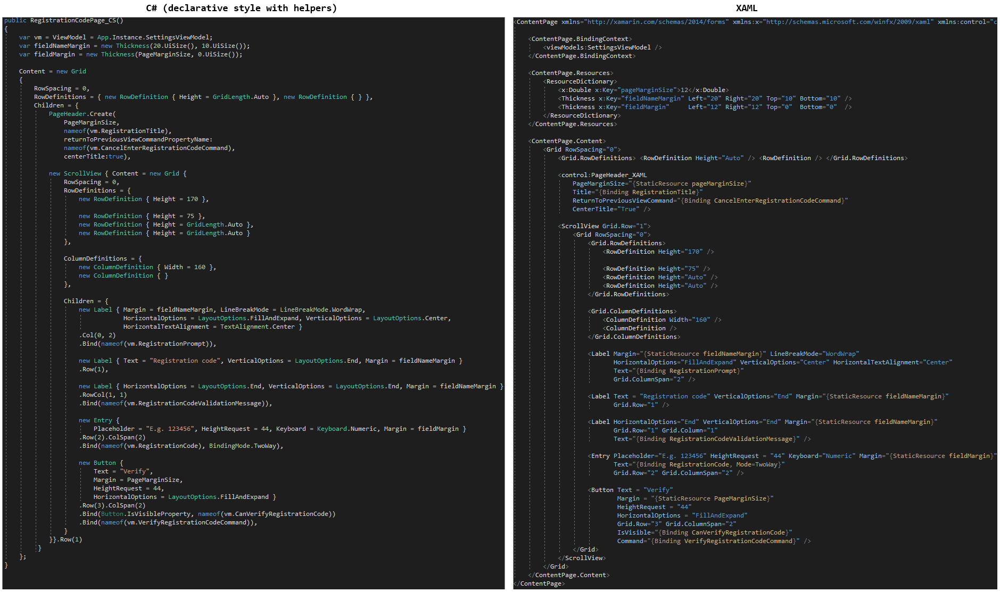

# CSharpForMarkup
Use declarative style C# instead of XAML for Xamarin Forms UI.

**Why?** Because declarative style C# has a much better developer experience and reads virtually the same as XAML.

Compare this markup for a simple registration code page (taken from a production app) in C# and XAML:

## Getting Started
All you need are [these simple helpers](src/XamarinFormsMarkupExtensions.cs).

The helpers offer a fluent API with **Bind**, **Invoke**, **Assign**, **Row**, **Col**, inline converters ...

Just include one .cs file in your project and off you go. Simple to change/extend.

## C# Versus XAML
These are some pro's of using C# versus XAML for markup in Xamarin Forms:

### Reading Pro's:

|      C#                                                                    |      XAML     |
| -------------                                                              | ------------- |
| Numbers and enums don't need quotes                                                        | Don't need enum name (i.e. **"End"** vs **LayoutOptions.End**) |
| Constants don't need keyword or quotes (i.e. **name** vs **"\{StaticResource name\}"** )   | Don't need **new** keyword for each control
| Can use calculated constants (i.e. **marginb = margina + 10**)                             | Don't need **Children = \{** or **Content =** for child controls  |
| Don't need parent class (i.e. **RowDefinitions** vs **Grid.RowDefinitions**)               |                                                                   |
| Designed for human readability                                                             | Designed for (visual designer) tools |
  
### Editing Pro's:

|      C#                                                                    |      XAML     |
| -------------                                                              | ------------- |
| Safe renaming and traceability. Binding can use **nameof** instead of strings for property names, rename refactor, code lens where used / not used, compile time checking all just work. | - |
| Better IntelliSense (i.e. in XAML margins are strings) | - |
| Simpler code reuse (control builder method) | - |
| Simple extensibility (i.e. don't need to write XAML extensions) | - |
| Better Diff & Merge | - |
| Visual Preview in Live Player (very limited - no renderers etc) | Visual Preview in Live Player and in IDE (very limited - no renderers etc)
| Visual Preview coming in [Live XAML](https://www.livexaml.com/) (few limitations) | Visual Preview in [Live XAML](https://www.livexaml.com/) (few limitations) 

## Summary
The question of C# versus XAML is not so much "Why use C# for markup?" as it is "**Why use XAML for markup?**"

- Why would you want to hand-code an object serialization format?
- Why would you choose a different language for markup if it reads the same but has inferior IDE support?
