# CSharpForMarkup [](https://gitter.im/CSharpForMarkup/community?utm_source=badge&utm_medium=badge&utm_campaign=pr-badge)
Use declarative style C# instead of XAML for Xamarin Forms UI.

># Newsflash : CSharpForMarkup to be incorporated in Xamarin Forms - vote now!
>Head on over to the [Spec CSharpForMarkup PR on the Xamarin Forms repo](https://github.com/xamarin/Xamarin.Forms/pull/8342) and like/thumbs/hurrah the PR:
>
>
>
>This is what the Xamarin Forms team looks at when deciding if/when to accept the PR.
>So if you want CSharpForMarkup to be supported by MS and to grow with Forms, make your vote count!
>Also chime in in the PR comments if you have ideas. Thanks!

All you need are [these simple helpers](src/XamarinFormsMarkupExtensions.cs); include the single .cs file in your project and off you go.

The helpers offer a fluent API with **Bind**, **Effects**, **Invoke**, **Assign**, **Row**, **Col**, **FormattedText**, **Style**, **Font**, inline converters, support for **using enums for Grid rows + columns** and more. Simple to change/extend; you could easily create your own markup DSL as in [this example in David Ortinau's Xappy](https://github.com/davidortinau/Xappy/blob/master/Xappy/Xappy/Content/Scenarios/Login/LoginPage.cs).

These helpers have been used to create production apps for years; see this [App video and source](#real-world-examples)

See CSharpForMarkup in action with [LiveSharp](https://github.com/OYIon/LiveSharp) for hot reload:

[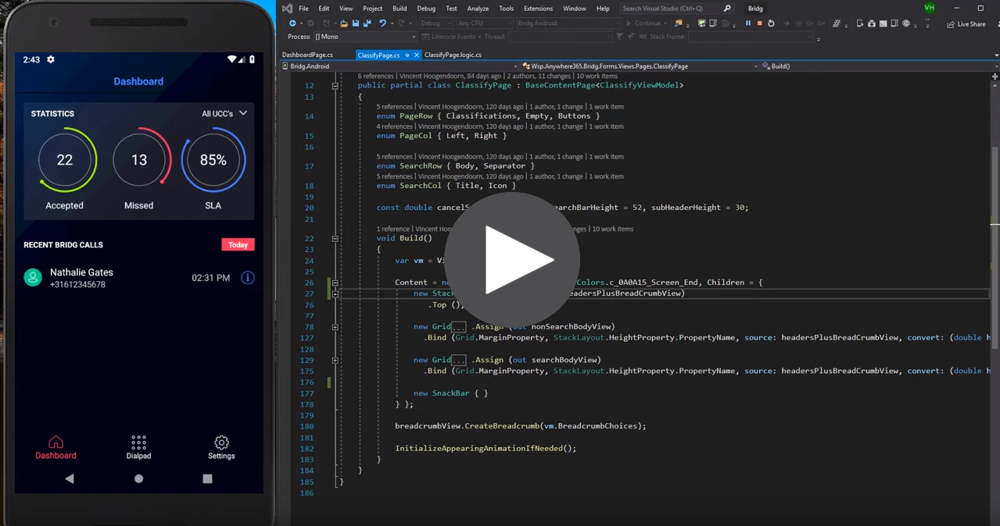](https://www.youtube.com/watch?v=HWxHTqzxT8Q "CSharpForMarkup with LiveSharp")

Check out this awesome Twitch stream by [David Ortinau](https://github.com/davidortinau) where [Ryan Davis](https://github.com/rdavisau) demonstrates these helpers - using hot reload!

[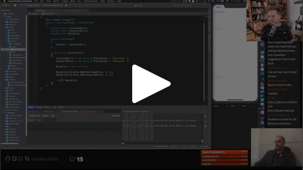](https://youtu.be/Mw2F1aHY0tQ?t=1116 "CSharpForMarkup with Ryan Davis and David Ortinau")

## Why?
Because **declarative UI** in C# has a much better developer experience than XAML, and reads either very similar or with more clarity.

Modern UI frameworks such as [Flutter](https://flutter.dev/) and [SwiftUI](https://developer.apple.com/xcode/swiftui/) offer declarative UI. These helpers offer the same for Xamarin Forms; no need to learn XAML.

If you do know XAML, you can keep using your knowledge, and gain productivity (because of the better IDE support for C# and because you don't need language bridging mechanisms). The syntax is very close to XAML and the same MVVM pattern is used; you should be familiar within a couple of hours.

## Declarative C# versus XAML
Compare this Entry markup:

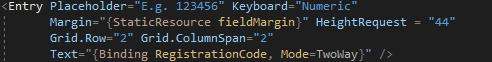 XAML

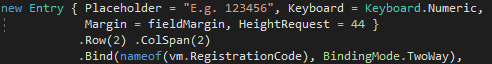 C#, close to XAML

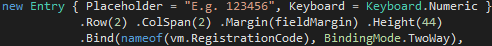 C#, shorter

See [Pro's and Con's](#declarative-c-versus-xaml-considerations) for a detailed comparison.

## How?
Use the extension methods listed below to set select view properties. These helpers offer a fluent API, but they are not meant to replace all property setters; they are added when they improve readability. They are meant to be used in combination with normal property setters. It is recommended to always use a helper when one exists for a property, but developers can choose a balance they prefer (e.g. to keep the markup more or less similar to XAML).

### Binding and converters
Use `Bind` as in the above C# examples

**Note** that `Bind` knows the default bindable property for most view types; you can omit it in most cases. You can also register the default bindable property for additional controls:
```CSharp
XamarinFormsMarkupExtensions.RegisterDefaultBindableProperties(
    HoverButton.CommandProperty, 
    RadialGauge.ValueProperty
);
```
You can specify any bindable property like this:  
```CSharp
new Label { Text = "No data available" }
.Bind (Label.IsVisibleProperty, nameof(vm.IsEmpty))
```

Bind a command to any type of view using **gesture recognizers**:
```CSharp
new Label { Text = "Tap Me" }
.BindTapGesture (nameof(vm.TapCommand)) // Or use any type of gesture with Bind<TView, TGestureRecognizer>(...)
```

Pass inline converter code with `convert` and `convertBack` parameters (type-safe):
```CSharp
new Label { Text = "Tree" }
.Bind (Label.MarginProperty, nameof(TreeNode.TreeDepth), convert: (int depth) => new Thickness(depth * 20, 0, 0, 0))
```
Re-use converter code and instances with `FuncConverter`:
```CSharp
treeMarginConverter = new FuncConverter<int, Thickness>(depth => new Thickness(depth * 20, 0, 0, 0));
//...
new Label { Text = "Tree" }
.Bind(Label.MarginProperty, nameof(TreeNode.TreeDepth), converter: treeMarginConverter),
```

Use `FormattedText` together with binding to `Spans`:
```CSharp
new Label { } .FormattedText (
    new Span { Text = "Built with " },
    new Span { TextColor = Color.Blue, TextDecorations = TextDecorations.Underline }
    .BindTap (nameof(vm.ContinueToCSharpForMarkupCommand))
    .Bind (nameof(vm.Title))
)
```
Note that you can bind gestures to spans with `BindTap` and `BindGesture` *(due to C#'s inability to have generic overloads with different where clauses these have to be named different from the helpers for Views)*.

### Layout
Use layout helpers for positioning views in layouts and content in views:
- In a `Grid`: `Row`, `Col`, `RowSpan`, `ColSpan`
- In a `FlexLayout`: `AlignSelf`, `Basis`, `Grow`, `Menu`, `Order`, `Shrink`
- Specify `LayoutOptions`:
  - `Left`, `CenterH`, `FillH`, `Right`
  - `LeftExpand`, `CenterExpandH`, `FillExpandH`, `RightExpand`
  - `Top`, `Bottom`, `CenterV`, `FillV`
  - `TopExpand`, `BottomExpand`, `CenterExpandV`, `FillExpandV`
  - `Center`, `Fill`, `CenterExpand`, `FillExpand`
- `Margin`, `Margins`
- `Height`, `Width`, `MinHeight`, `MinWidth`, `Size`, `MinSize`
- `Padding`, `Paddings`
- In a `Label`:
  - `TextLeft`, `TextCenterH`, `TextRight`
  - `TextTop`, `TextCenterV`, `TextBottom`
  - `TextCenter`

The **recommended convention** is to put all helpers from above set for a view on a single line, in the order that they are listed above. This creates a layout line that visually zooms in on the view content:
1. Row & col that contain the view
2. Alignment within row & col
3. Margin around view
4. View size
5. Padding within view
6. Content alignment within padding

Consistently applying this convention enables developers to quickly visually scan and zoom in on markup to build a mental map of where the view content is located.

### Enums for Grid rows and columns
By adding `using static CSharpForMarkup.EnumsForGridRowsAndColumns;` developers can use enums for Grid rows and columns instead of numbers, so they don't have to renumber manually when they add or remove rows or columns. Readability and intent of the layout is also improved:

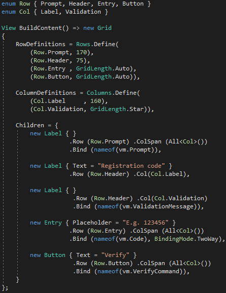

### Fonts
- In a `Label`: `FontSize`, `Bold`, `Italic`
- In `Button`, `Label`, `Entry`, `Picker`: `Font`

### Effects
```CSharp
new Button { Text = "Tap Me" }
.Effects (new ButtonMixedCaps())
```

### Logic integration 
Use `Invoke` to execute code inline in your declarative markup:
```CSharp
new ListView { } .Invoke (l => l.ItemTapped += MyListView_ItemTapped)
```

Use `Assign` if you need to access a control from outside the UI markup (in UI logic):
```CSharp
new ListView { } .Assign (out MyListView),
```

### Styles
Use `Style` to create type-safe, declarative coded styles:
```CSharp
using static CSharpForMarkupExample.Styles;
...
new Button { Text = "Tap Me" } .Style (FilledButton), // Use .Style for VisualElement types
...
new Span { Text = "delightful", Style = Quote }, // Use the implicit Style type converter for other Element types
```

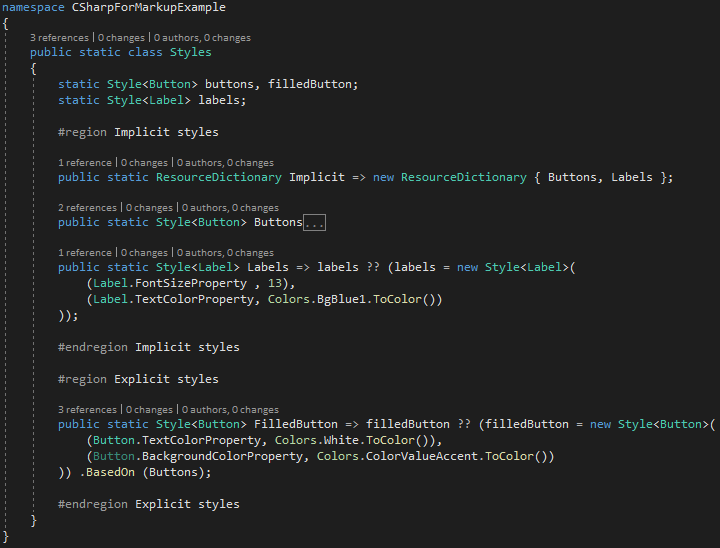


Note that instead of using `Style`, you can simply create your own extension methods to set styling even more type-safe:
```CSharp
new Button { Text = "Tap Me" } .Filled ()
```
```CSharp
public static TButton Filled<TButton>(this TButton button) where TButton : Button
{
    button.Buttons(); // Equivalent to Style .BasedOn (Buttons)
    button.TextColor = Color.White;
    button.BackgroundColor = Color.Red;
    return button;
}
```

### Platform Specifics
There is also support for some Platform Specifics e.g. `iOSSetGroupHeaderStyleGrouped`. 
Using these helpers avoids the name conflicts on view types that you get when using platform specifics from the Xamarin Forms namespaces.

## Real World Examples

These helpers are battle tested for usability and stability. They have been used for years to build production apps, e.g. the app in this video:

[](http://www.youtube.com/watch?v=50N1LL_Txe8 "LiveSharp Production App")

How about some real-world source? Here is a simple registration code page (taken from a production app):

XAML:

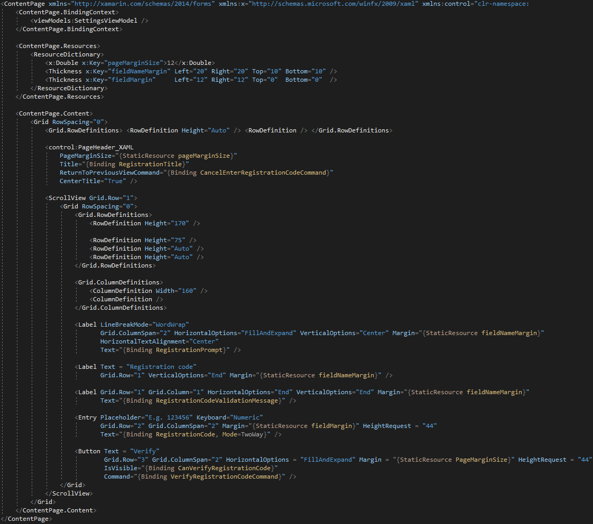

C#, close to XAML:

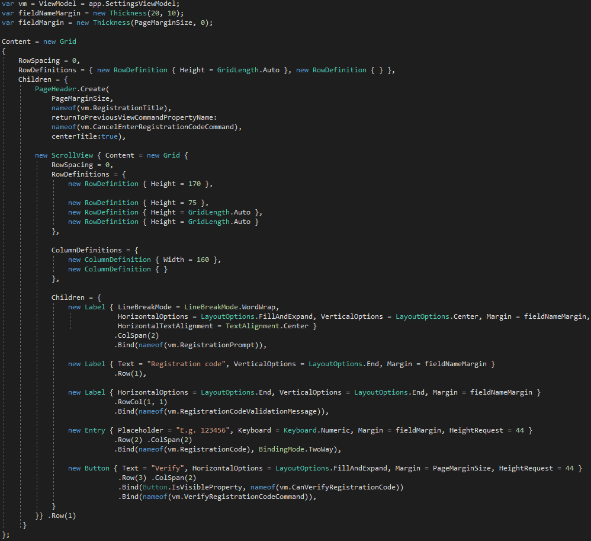

By using more helper methods, you can further improve C# readability (but it will be less simular to the XAML):

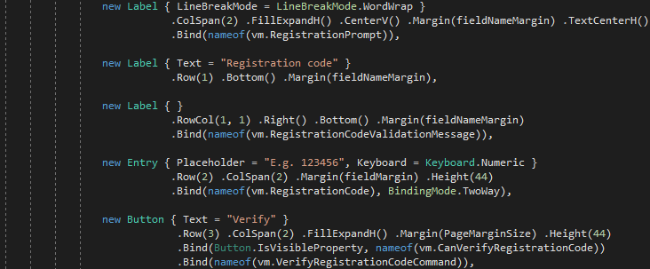

This markup follows some conventions:

## Conventions
Recommended markup formatting conventions for every control:
- Bound properties are last, one per line. The default bindable property, if any, should be the very last line.
- The line before the bound properties is about layout, ordered inward: rows / cols, layout options, margin, size, padding, content alignment.

  Consistently applying these conventions allows to visually scan / zoom markup and build a mental map of the layout.
- Before that are the other properties; any property that identifies the control's purpose should be on the very first line (e.g. Text or Placeholder)

## Declarative C# versus XAML considerations 
Some observations that may help you if you like XAML but wonder whether declarative C# would work for you:

### Patterns and Tooling Pro's:
C#

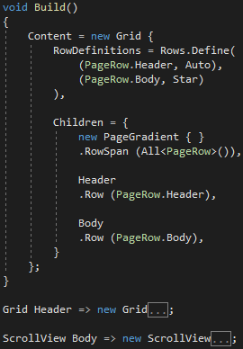

- Simply **compose markup top-down** with **named** methods or properties for better maintainability of complex UI. It can read like a story (see example above)
- **Refactorings** like renaming a bindable property work reliably across logic and markup; zero chance of broken bindings.
- Cleanly separate UI markup from UI logic while encapsulating both in a single class with **partial class** files, e.g. `LoginPage.cs` + `LoginPage.logic.cs`.
- No need for separate [Value Converter](https://docs.microsoft.com/en-us/xamarin/xamarin-forms/app-fundamentals/data-binding/converters) classes. Inlining simple value converter code in your markup improves UI maintainability.
- No need for [XAML Triggers](https://docs.microsoft.com/en-us/xamarin/xamarin-forms/app-fundamentals/triggers)
- No need for [XAML Compilation](https://docs.microsoft.com/en-us/xamarin/xamarin-forms/xaml/xamlc)
- No need for [XAML Compiled Bindings](https://docs.microsoft.com/en-us/xamarin/xamarin-forms/app-fundamentals/data-binding/compiled-bindings). Bindings are fully compiled, including bindings that specify the `Source` property (which XAML can't compile).

### Reading Pro's:
C#
- Numbers and enums don't need quotes
- Constants don't need keyword or quotes (i.e. **name** vs **"\{StaticResource name\}"** )
- Can use calculated constants (i.e. **marginb = margina + 10**)
- Don't need parent class (i.e. **RowDefinitions** vs **Grid.RowDefinitions**)
- Designed for human readability

XAML
- Don't need enum name (i.e. **"End"** vs **LayoutOptions.End**)
- Don't need **new** keyword for each control
- Don't need **Children = \{** or **Content =** for child controls
- Designed for (visual designer) tools
  
### Editing Pro's:
C#
- No strings for properties: rename, code lens (where/not) used, compile time safety all just work
- Better IntelliSense (i.e. in XAML margins are strings)
- Simpler markup reuse (control builder method with parameters)
- Simple extensibility (i.e. don't need to write XAML extensions; customize your markup syntax with extension methods, creating your own DSL if you like)
- Better Diff & Merge
- **HotReload** in [LiveSharp](https://marketplace.visualstudio.com/items?itemName=ionoy.LiveSharp)

XAML
- Visual preview in IDE (very limited - no renderers etc)
- **HotReload** in [LiveXAML](https://www.livexaml.com/)

## Summary
The question of C# versus XAML is not so much "Why use C# for markup?" as it is "**Why use XAML for markup?**"

- Why would you want to hand-code an object serialization format?
- Why would you choose a different language for markup if it reads the same but has inferior IDE support?
- Why would you scatter your UI markup with language bridging mechanisms? (converters etc)

## Background
This repo resulted from this discussion on the Xamarin Forms forum:
[Using declarative style C# instead of XAML - should Xamarin redirect XAML efforts elsewhere?](https://forums.xamarin.com/discussion/123771/using-declarative-style-c-instead-of-xaml-should-xamarin-redirect-xaml-efforts-elsewhere?)

Imo XAML in Xamarin Forms exists for historical reasons, to convince developers that are familiar with other Microsoft XAML dialects to onboard. However, if used as above, developers can use their existing XAML knowledge in C#. It should not take more than a day to become accustomed to the small syntax changes, to gain productivity every day.

NJoy!
